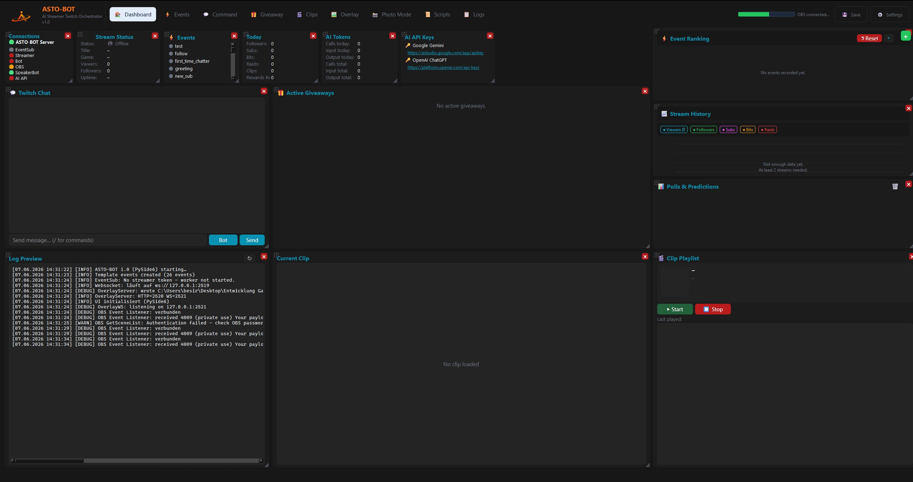
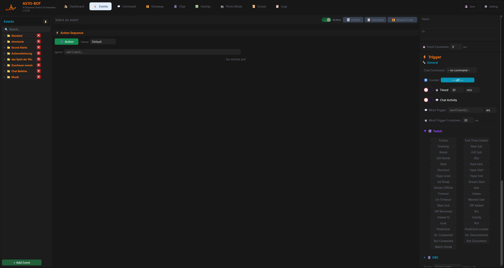
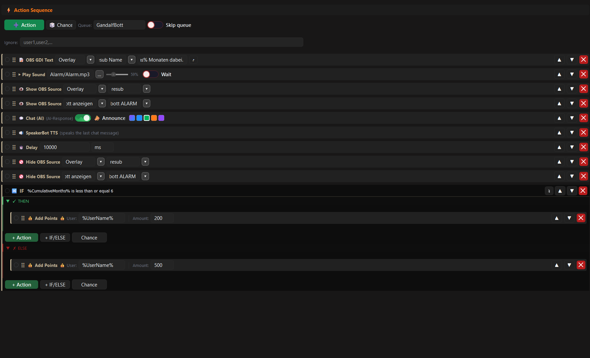
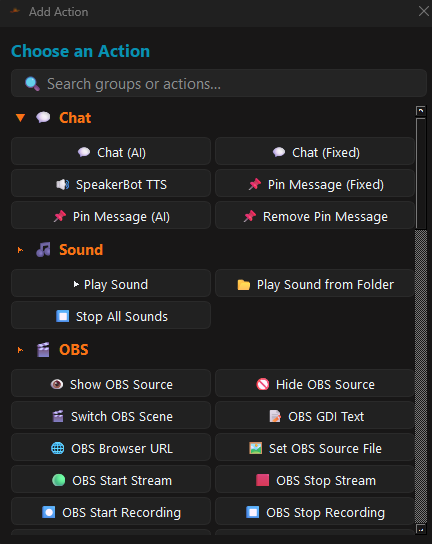
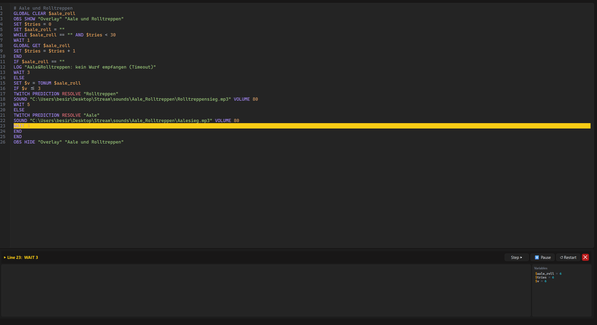
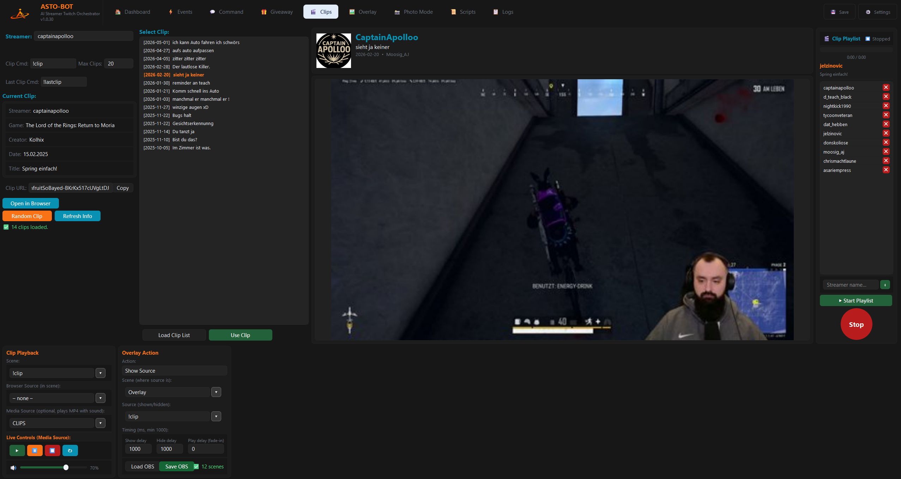
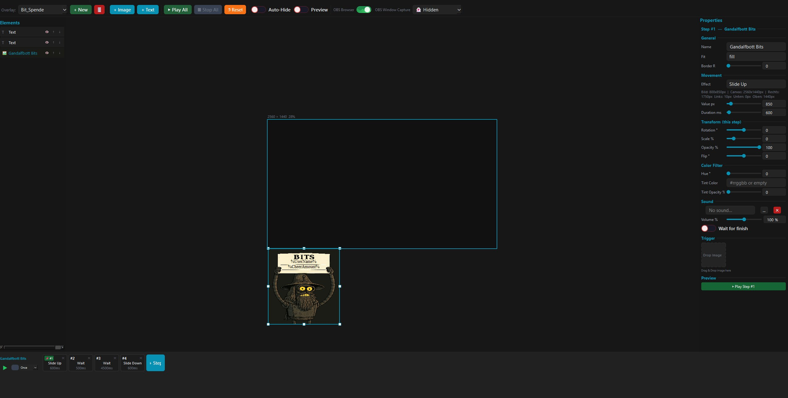
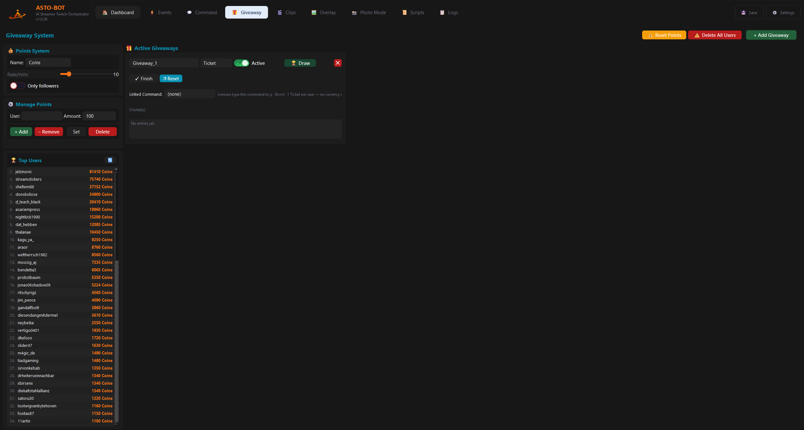
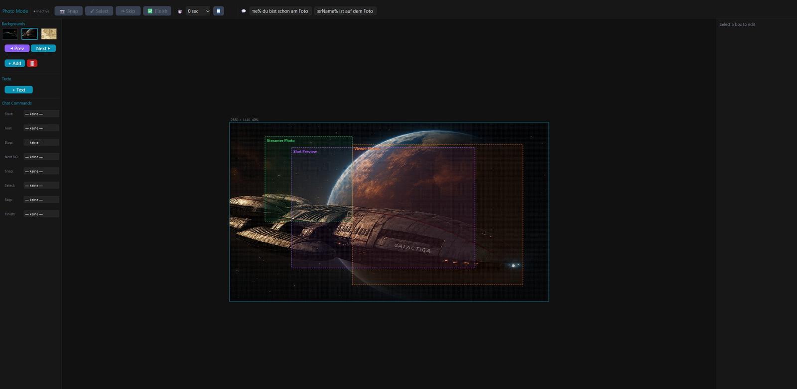

<div align="center">
  

<a href="../../releases"></a>
<a href="https://discord.gg/n2nstVwspk"></a>
<a href="https://ko-fi.com/captainapolloo"></a>

# ASTO-BOT

### AI Streamer Twitch Orchestrator

**ASTO-BOT** is an all-in-one Twitch stream management tool for Windows. It connects directly to Twitch, OBS Studio, and AI services, letting you automate your stream without writing a single line of code — but also giving you a full scripting language if you want to go further.

[Download](#installation) · [Discord](https://discord.gg/n2nstVwspk) · [Support on Ko-fi](https://ko-fi.com/captainapolloo) · [User Manual 🇬🇧](ASTO-BOT_User_Manual.pdf) · [Benutzerhandbuch 🇩🇪](ASTO-BOT_Benutzerhandbuch.pdf)

</div>

-----

## Features

- **AI-powered event responses** — follows, subs, raids, bits, channel points and more trigger AI-generated or fixed chat messages with a custom bot personality
- **OBS Integration** — switch scenes, show/hide sources, set GDI text and browser URLs automatically
- **ASTOSCRIPT** — built-in scripting language with variables, conditions, loops, HTTP requests and OBS control
- **Visual Overlay Editor** — build animated overlays (images + text) for OBS Browser Source or Window Capture, with per-step sounds and multiple timelines
- **Clip Manager** — browse, label and play Twitch clips via playlist or chat command
- **Giveaway & Points System** — viewers earn custom points over time and spend them to enter giveaways
- **Photo Mode** — live group photo sessions where viewers join via chat command and appear on stream
- **Stream Deck & WebSocket** — trigger events, scripts and overlays from any external tool on port 2519
- **Channel Point Rewards** — create, edit and link rewards directly from ASTO-BOT (required for refund support)
- **Chat Commands** — configurable commands with permission levels, cooldowns and group management

-----

## Screenshots

### Dashboard



### Events & Actions





### ASTOSCRIPT



### Clips



### Overlay Editor



### Giveaway & Points



### Photo Mode



-----

## Installation

1. Download `ASTO-BOT_Installer.exe` from the [Releases](../../releases) page.
1. Run the installer and choose an installation folder, e.g. `C:\Program Files\ASTO-BOT\`
1. Follow the installer instructions — ASTO-BOT starts automatically after installation.
1. Go to **Settings → Twitch** and connect your Streamer and Bot accounts.
1. Optionally connect OBS via **Settings → OBS** (WebSocket, default `ws://127.0.0.1:4455`).

> ⚠ To uninstall, use **Control Panel → Programs → Uninstall ASTO-BOT** or the included `uninstall-asto.exe`. Never delete the folder manually.

### Requirements

- Windows 10 or Windows 11 (64-bit)
- Internet connection (for Twitch authentication and AI features)
- OBS Studio 28 or later *(optional, for overlay and scene automation)*

-----

## Quick Start

### 1. Connect your accounts

Open **Settings → Twitch**, click **Connect** next to *Streamer*, log in, then repeat for *Bot*.
Open **Settings → AI**, enter your Gemini or ChatGPT API key and configure your bot’s personality.

### 2. Create your first Event

Go to **Events**, click **+ Add Event**, select a trigger (e.g. *Follow*), then click **+ Action** to add what should happen — a chat message, a sound, an overlay, an OBS scene change, or anything else.

### 3. Write a Script (optional)

Go to **Scripts**, create a new script, and write ASTOSCRIPT. Click **Tutorial** to open the built-in reference, or use **Copy AI Prompt** to let an AI write the script for you.

```
# Example: greet a subscriber and play a sound
CHAT "Welcome to the sub club, " + %UserName% + "! 🎉"
SOUND "fanfare.mp3" VOLUME 80
WAIT 2
OBS SCENE "Sub Cam"
```

-----

## ASTOSCRIPT — Key Commands

|Command                     |Description                                    |
|----------------------------|-----------------------------------------------|
|`CHAT "text"`               |Send a message to Twitch chat                  |
|`WAIT 5`                    |Wait 5 seconds (`WAIT 500 MS` for milliseconds)|
|`OBS SCENE "name"`          |Switch OBS scene                               |
|`SOUND "file.mp3" VOLUME 80`|Play a sound                                   |
|`POINTS ADD %UserName% 50`  |Award points to a viewer                       |
|`IF / ELSE / END`           |Conditional logic                              |
|`WHILE / END`               |Loop (max 100,000 iterations)                  |
|`HTTP GET "url"`            |Make an HTTP request                           |
|`SET $var = value`          |Set a variable                                 |
|`STOP`                      |Terminate the script                           |

All built-in event variables (`%UserName%`, `%OBSScene%`, `%IsSubscriber%`, …) are available in scripts, events, and overlays.

-----

## WebSocket Integration

ASTO-BOT listens on `ws://127.0.0.1:2519` (local only). Send JSON to control it from any tool, including the Elgato Stream Deck (*Web Requests* plugin):

```json
{ "script": "my_script_name" }
{ "event": "follow" }
{ "event": "shoutout", "input": "username" }
{ "overlay": "overlay_name" }
{ "playlist": "start" }
{ "photo": "start", "user": "username" }
```

-----

## Data & Privacy

ASTO-BOT runs entirely locally. All configuration files live in the installation folder:

|Path                    |Contents                      |
|------------------------|------------------------------|
|`Config/asto_secure.bin`|Tokens & passwords (encrypted)|
|`Config/`               |All other settings            |
|`Scripts/`              |Your ASTOSCRIPT files         |
|`Overlays/`             |Overlay definitions           |
|`Sounds/`               |Audio files                   |

Use **Settings → Backup** to create a full backup archive at any time.

-----

## Support

Join the Discord server for help, feature requests and updates: **[discord.gg/n2nstVwspk](https://discord.gg/n2nstVwspk)**

If you enjoy ASTO-BOT and want to support the development: **[ko-fi.com/captainapolloo](https://ko-fi.com/captainapolloo)** ☕

-----

<div align="center">
<sub>Developed by CaptainApolloo · Version 1.0.9 · 2026 · All rights reserved</sub>
</div>
